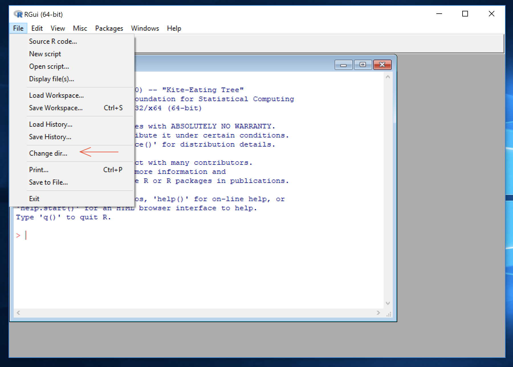
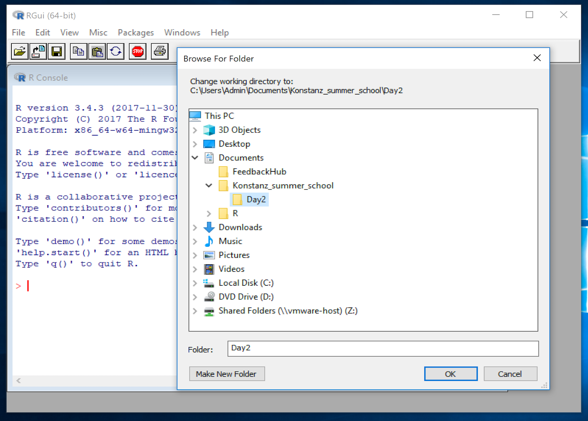
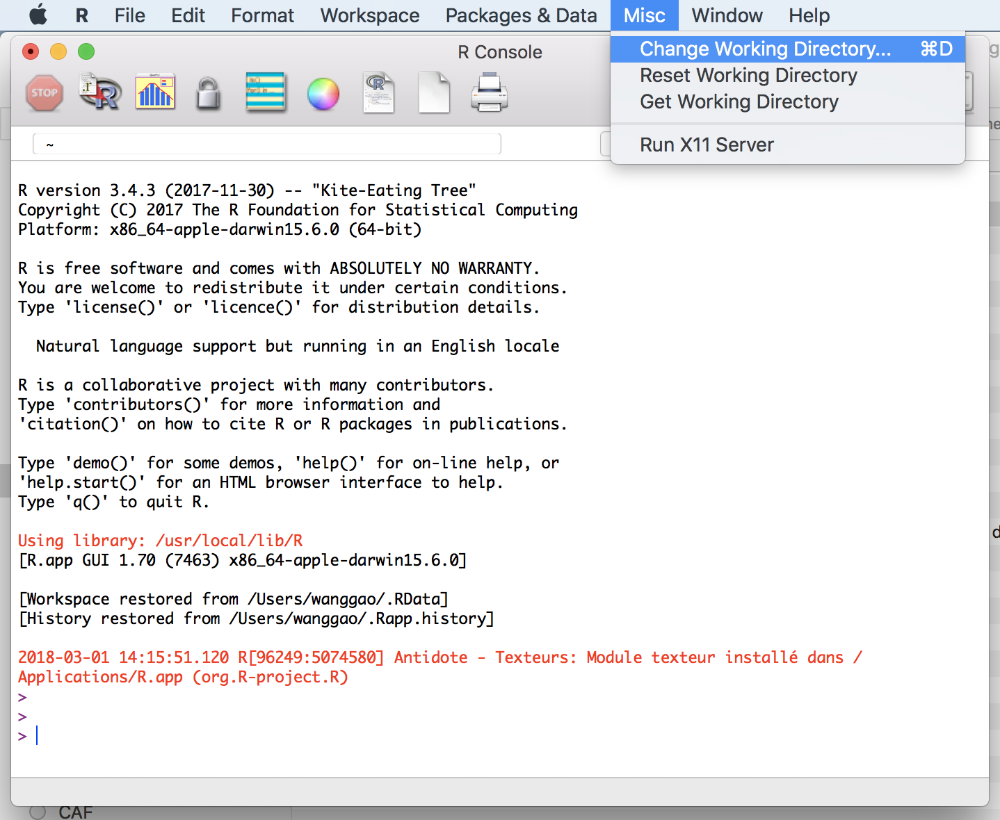
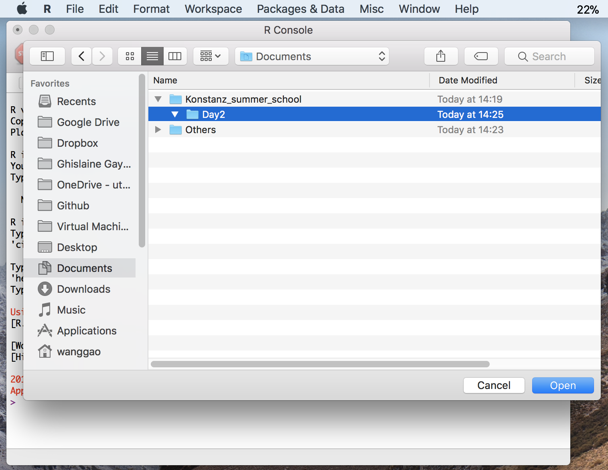

```{r setup, include=FALSE}
knitr::opts_knit$set(root.dir = '..')
if(!require(magrittr)) {install.packages("magrittr"); library(magrittr);}
# rm(list = ls())
# knitr::opts_chunk$set(fig.align = 'center', fig.show='hold', out.width = '70%',
                      # warning=FALSE, message=FALSE)

knitr::opts_chunk$set(
  comment = "#>",
  # collapse = TRUE,
  cache = TRUE,
  out.width = "100%",
  fig.align = 'center',
  fig.width = 8,
  fig.asp = 0.618,  # 1 / phi
  fig.show = "hold",
  warning=FALSE, message=FALSE,
  eval = FALSE
)
```


<!-- ## Frédéric's mail { - }  -->

<!-- > Salut Wang:  -->
<!-- > tu peux mettre ce script ou l'adapter?  -->
<!-- > Il leur faut aussi pouvoir telecharger le fichier de données (a mettre au meme endroit que le script!  -->
<!-- >  -->
<!-- > J'imagine que la moitié ne sauront pas même faire ça... sans parler des problemes d'extension sous > windows;  -->
<!-- > à prendre les gens pour des idiots on en fait des idiots) -->


<!-- ## The Plan of Work { - }  -->

<!-- - Installing R: and package BN learn, test if the package is well  -->
<!-- - Dose-response modelling -->
<!--     - KBrO3 -> GSH dataset -->
<!--     - Préparer un script (html) : -->
<!--     - 45 min de formation de R -->
<!--         - Vecteur c() -->
<!--         - Assignement x =  -->
<!--         - Concept -->
<!--         - Fonction (demo) -->
<!--         - Packages -->
<!--     - Faire ajuster à la main un modèle de Hill avec quatre parametre à jouer -->
<!-- Top Bottom  -->

<!-- ---- -->

# Preperation

## Set Working Directory (WD)

R is always pointed at a directory on your computer. By default, 

- R loads files (Plain text files / Data files etc.) from this directory.
- R outputs files (Plain text files / Data files etc.) to this directory.

- Set **W**orking **D**irectory (WD)
    - **On Windows** 
        - in R interface choose : `Menu - File - Change dir...`
        - Choose a local directory (folder)
            - for example I use `C:/Users/Admin/Documents/Konstanz_summer_school/Day2` (actrually Day 3) as my working directory
        - { width=49.2% } { width=49.3% }
    - **On MacOs** 
        - in R insterface choose : `menu - Misc - Change Working Directory...`
            - for example I use `~/Documents/Konstanz_summer_school/Day2` as my working directory
        - { width=47.5% } { width=50.5% }
    - **Verify your WD**
        - type `getwd()` in R console prompt: after `>`, then press `enter` key
        - R should print your current **WD**

## Download dataset and load it to R

- The dataset is accessible via the following two links [**Link 1**](https://trello-attachments.s3.amazonaws.com/59552633a56853b5f6d1f1f9/5a92760183331b90626ce166/678efebfc21386538df65c23120fc741/data_GSH.txt) or [**Link 2**](https://antoinechn.github.io/Konstanz-SummerSchool/data/data_GSH.txt)
- Click on one of the two Links, a new web page will open then you have two options
    - Option 1: press Windows Shortcut : `Control + S` or MacOS Shortcut : `Command ⌘ + S` 
    - Option 2: right click your mouse (or touchpad) and choose `save as`
- save `data_GSH.txt` to your working directory (in my case `/Documents/Konstanz_summer_school/Day2`)
- once this is done, type `list.files()` in R console prompt: after `>`, then press `enter` key
- R should print all files in your working directory. Check if `data_GSH.txt` is listed
- if not click on <button class="btn btn-primary" data-toggle="collapse" data-target="#SOSDownloadData"> Need help ? </button>  

<div id="SOSDownloadData" class="collapse">  
<div class="boxed">

Copy - Paste in R console prompt: after `>`, then press `enter` key
```{r eval=FALSE}
tmpData = readLines("https://antoinechn.github.io/Konstanz-SummerSchool/data/data_GSH.txt")
writeLines(tmpData, "data_GSH.txt")
rm(tmpData)
```

- once this is done, type `list.files()` in R console prompt: after `>`, then press `enter` key
- R should print all files in your working directory. Check if `data_GSH.txt` is listed
- if still not 
    - check your internet connection !!!
    - or contact us.

```{r eval = FALSE}
list.files()
```

</div>
</div>

## Load data

This is `GSH` (after 1h)

```{r eval = T}
data_GSH = read.table("data_GSH.txt", sep="\t", header=TRUE)

head(data_GSH)
```

<button class="btn btn-primary" data-toggle="collapse" data-target="#SOSLoadData"> Need help ? </button> 
<div id="SOSLoadData" class="collapse">  
<div class="boxed">

**Try this**
```{r eval = F}
data_GSH = read.table("https://trello-attachments.s3.amazonaws.com/59552633a56853b5f6d1f1f9/5a92760183331b90626ce166/678efebfc21386538df65c23120fc741/data_GSH.txt", sep="\t", header=TRUE)

head(data_GSH)
```

<button class="btn btn-primary" data-toggle="collapse" data-target="#SOSLoadDataM2"> Still not working ? </button> 
<div id="SOSLoadDataM2" class="collapse">  

**Try this**
```{r eval = F}
data_GSH = read.table("https://antoinechn.github.io/Konstanz-SummerSchool/data/data_GSH.txt", sep="\t", header=TRUE)

head(data_GSH)
```

</div>

</div>
</div>

----

----

# Data visualisation using `plot()`

Plot the data to get a sense of it
```{r BA_Plot}
plot(data_GSH$KBrO3_mM, data_GSH$pct_control)
```


<button class="btn btn-primary" data-toggle="collapse" data-target="#Output_BA_Plot"> Show output </button> 
<div id="Output_BA_Plot" class="collapse">  
<div class="boxed">

```{r ref.label="BA_Plot", eval=TRUE, echo=FALSE}
```

</div>
</div>

---

**You have plenty of options, the most useful are:**

```{r Other_plot}
# nicer
plot(data_GSH$KBrO3_mM, data_GSH$pct_control, las=1)
# professional
plot(data_GSH$KBrO3_mM, data_GSH$pct_control, las=1,
     xlab="KBrO3 (mM)", ylab="GSH decrease (%)")
# excellent
plot(data_GSH$KBrO3_mM, data_GSH$pct_control, las=1,
     xlab="KBrO3 (mM)", ylab="GSH decrease (%)", main="My Beautiful Data")
# clever
plot(data_GSH$KBrO3_mM, data_GSH$pct_control, las=1,
     xlab="KBrO3 (mM)", ylab="GSH decrease (%)", main="My Beautiful Data",
     log="y") # you can use log="x" or "y" or "xy" or "" 
# genius level
plot(data_GSH$KBrO3_mM, data_GSH$pct_control, las=1,
     xlab="KBrO3 (mM)", ylab="GSH decrease (%)", main="My Beautiful Data",
     log="y", pch=10, cex= 1.3, col="red") # set the type of mark, size, color

# etc. see help(par) or ?par for all the parameters you can set
```

<button class="btn btn-primary" data-toggle="collapse" data-target="#Output_BA_OtherPlot"> Show output </button> 
<div id="Output_BA_OtherPlot" class="collapse">  
<div class="boxed">
```{r eval = T}
# nicer
plot(data_GSH$KBrO3_mM, data_GSH$pct_control, las=1)
```
```{r eval = T}
# professional
plot(data_GSH$KBrO3_mM, data_GSH$pct_control, las=1,
     xlab="KBrO3 (mM)", ylab="GSH decrease (%)")
```
```{r eval = T}
# excellent
plot(data_GSH$KBrO3_mM, data_GSH$pct_control, las=1,
     xlab="KBrO3 (mM)", ylab="GSH decrease (%)", main="My Beautiful Data")
```
```{r eval = T}
# clever
plot(data_GSH$KBrO3_mM, data_GSH$pct_control, las=1,
     xlab="KBrO3 (mM)", ylab="GSH decrease (%)", main="My Beautiful Data",
     log="y") # you can use log="x" or "y" or "xy" or "" 
```

```{r eval = T}
# genius level
plot(data_GSH$KBrO3_mM, data_GSH$pct_control, las=1,
     xlab="KBrO3 (mM)", ylab="GSH decrease (%)", main="My Beautiful Data",
     log="y", pch=10, cex= 1.3, col="red") # set the type of mark, size, color
```
</div>
</div>

----

----

# Modelling

## Hill dose-response model
Let's get serious:

- define the Hill dose-response model as a function
- let's try it
- plot it...

```{r eval = F}
# define the Hill dose-response model as a function
Hill = function (x, EC50, n) {
  return(x^n / (x^n + EC50^n))
}

# let's try it
Hill(x=10, EC50=1, n=1)

# plot it...
x = seq(0, 10, 0.1)
y = Hill(x=x, EC50=1, n=3)
plot(x, y, type="b")
```

<button class="btn btn-primary" data-toggle="collapse" data-target="#Output_Modelling_defineHillFunction"> Show output </button> 
<div id="Output_Modelling_defineHillFunction" class="collapse">  
<div class="boxed">

```{r eval=TRUE}
# define the Hill dose-response model as a function
Hill = function (x, EC50, n) {
  return(x^n / (x^n + EC50^n))
}
# let's try it
Hill(x=10, EC50=1, n=1)
```
```{r eval=TRUE}
# plot it...
x = seq(0, 10, 0.1)
y = Hill(x=x, EC50=1, n=3)
plot(x, y, type="b")
```

</div>
</div>

**Problem:** 

- it goes up from zero to one 
- and we want it to go down from 100 to 0

----

## Extended Hill dose-response model

**So we change it a bit**

- define an extended Hill dose-response model as a function
- try it...
- plot it...
```{r redefineHillFunction, eval = F}
# define an extended Hill dose-response model as a function
Hill = function (x, EC50, n, from, diff) {
  return(from + diff * (x^n / (x^n + EC50^n)))
}

# try it
Hill(x=10, EC50=1, n=1, from=1, diff=10)

# plot it...
x = seq(0, 10, 0.1)
y = Hill(x=x, EC50=1, n=3, from=1, diff=10)
plot(x, y, type="b")
```

<button class="btn btn-primary" data-toggle="collapse" data-target="#Output_Modelling_redefineHillFunction"> Show output </button> 

<div id="Output_Modelling_redefineHillFunction" class="collapse">  
<div class="boxed">
```{r eval=TRUE}
# define an extended Hill dose-response model as a function
Hill = function (x, EC50, n, from, diff) {
  return(from + diff * (x^n / (x^n + EC50^n)))
}

# try it
Hill(x=10, EC50=1, n=1, from=1, diff=10)
```
```{r eval=TRUE}
# plot it...
x = seq(0, 10, 0.1)
y = Hill(x=x, EC50=1, n=3, from=1, diff=10)
plot(x, y, type="b")
```
</div>
</div>

----

**Question**

- Can you find values of from and diff that would match the data range?
    - first: what is the data range?
    - assign the values found to variables A and B

```{r eval = FALSE}
# assign the values found to variables A and B
A =
B =
```

```{r eval = F, echo=F}
xlims = c(0, 6) # a vector of min and max
ylims = c(0, 120)
plot(data_GSH$KBrO3_mM, data_GSH$pct_control, xlim=xlims, ylim=ylims, col="red")
par(new=T) # will overlay the next plot
x = seq(0, 6, 0.1)
y = Hill(x=x, EC50=1, n=3, from=A, diff=B)
plot(x, y, type="l", xlim=xlims, ylim=ylims, xlab="", ylab="") # turn off labels
```

**now replot the data and overlay with the model**

Note : make sure to define the axes limits before doing overlays...

```{r}
xlims = c(0, 6) # a vector of min and max
ylims = c(0, 120)
plot(data_GSH$KBrO3_mM, data_GSH$pct_control, xlim=xlims, ylim=ylims, col="red")
par(new=T) # will overlay the next plot
x = seq(0, 6, 0.1)
y = Hill(x=x, EC50=1, n=3, from=A, diff=B)
plot(x, y, type="l", xlim=xlims, ylim=ylims, xlab="", ylab="") # turn off labels
```

**now play with EC50 and N to fit the data better**

<button class="btn btn-primary" data-toggle="collapse" data-target="#Output_Modelling_ExpectedFitPlot"> Show one possible fit plot </button> 

<div id="Output_Modelling_ExpectedFitPlot" class="collapse">  
<div class="boxed">
<!-- You can expect one fit like this: -->
```{r eval=TRUE, echo=F}
A = 100
B = -100
MyEC50 = 0.5
MyN = 1.8

xlims = c(0, 6) # a vector of min and max
ylims = c(0, 120)
plot(data_GSH$KBrO3_mM, data_GSH$pct_control, xlim=xlims, ylim=ylims, col="red")
par(new=T) # will overlay the next plot
x = seq(0, 6, 0.1)
y = Hill(x=x, EC50=MyEC50, n=MyN, from = A, diff = B)
plot(x, y, type="l", xlim=xlims, ylim=ylims, xlab="", ylab="") # turn off labels
```

<button class="btn btn-primary" data-toggle="collapse" data-target="#Output_Modelling_ExpectedFitPar"> Show parameters </button> 
<div id="Output_Modelling_ExpectedFitPar" class="collapse">  
- `A = 100`
- `B = -100`
- `EC50 = 0.5`
- `n = 1.8`
</div>
</div>
</div>

## Inverting the Hill dose-reponse model

- Can you code a function inverting the Hill dose-response model?
- Plot the function you found.

$$y = A + B \times \frac{x^n}{x^n+ {EC_{50}}^n} $$

Define a function 

```{r eval = F}
inv.hill = function(y, EC50, A, B, n){
   YOUR CODE HERE
  }

```


## Notes

There are many tools in R that can be used to fit automatically your model one of them is PROAST (from the RIVM) but we can also access PROAST online (more fun)

## Visit the three following links

https://www.rivm.nl/en/Documents_and_publications/Scientific/Models/PROAST

https://proastweb.rivm.nl

https://www.epa.gov/bmds

----

----

[Back to home](https://goo.gl/j9PYg4)