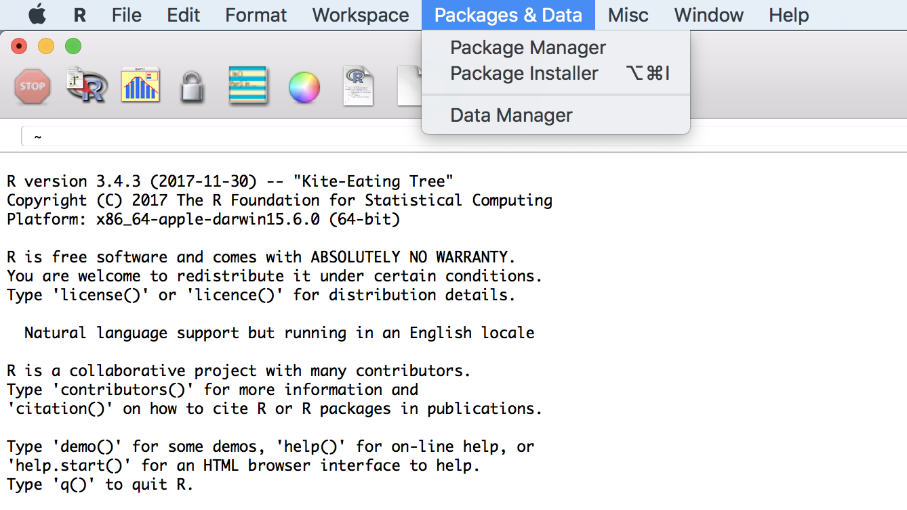
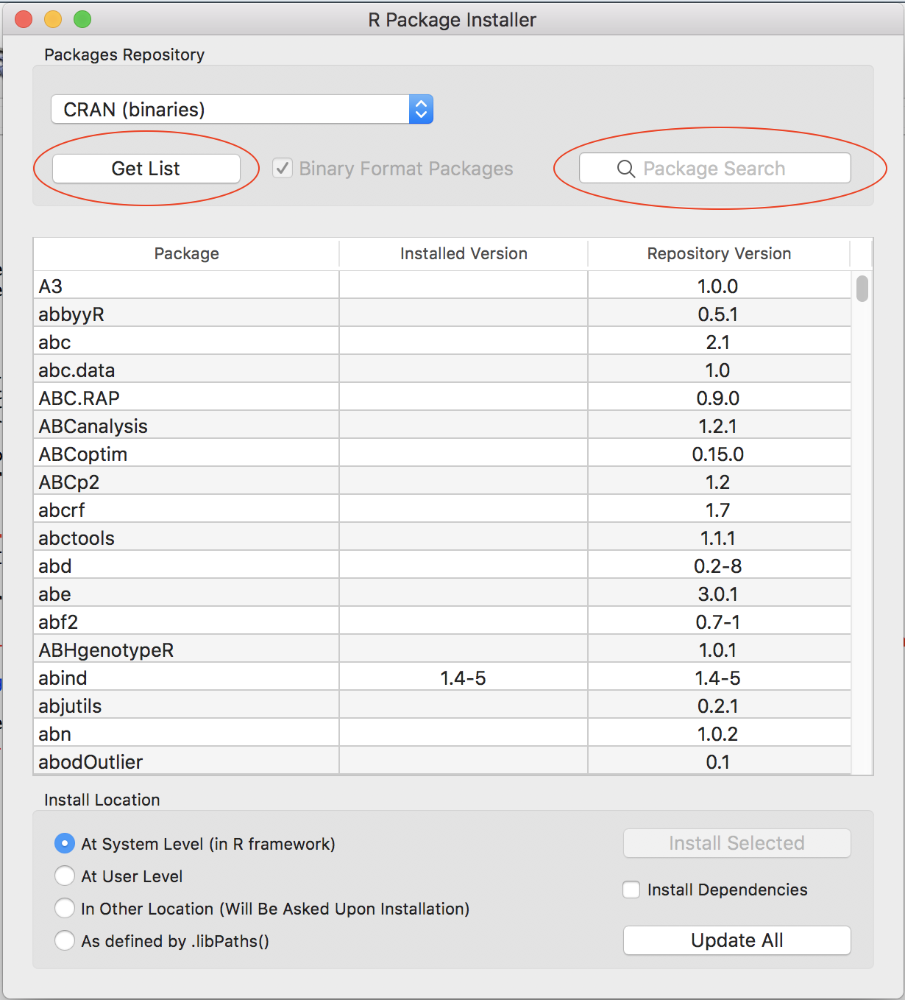
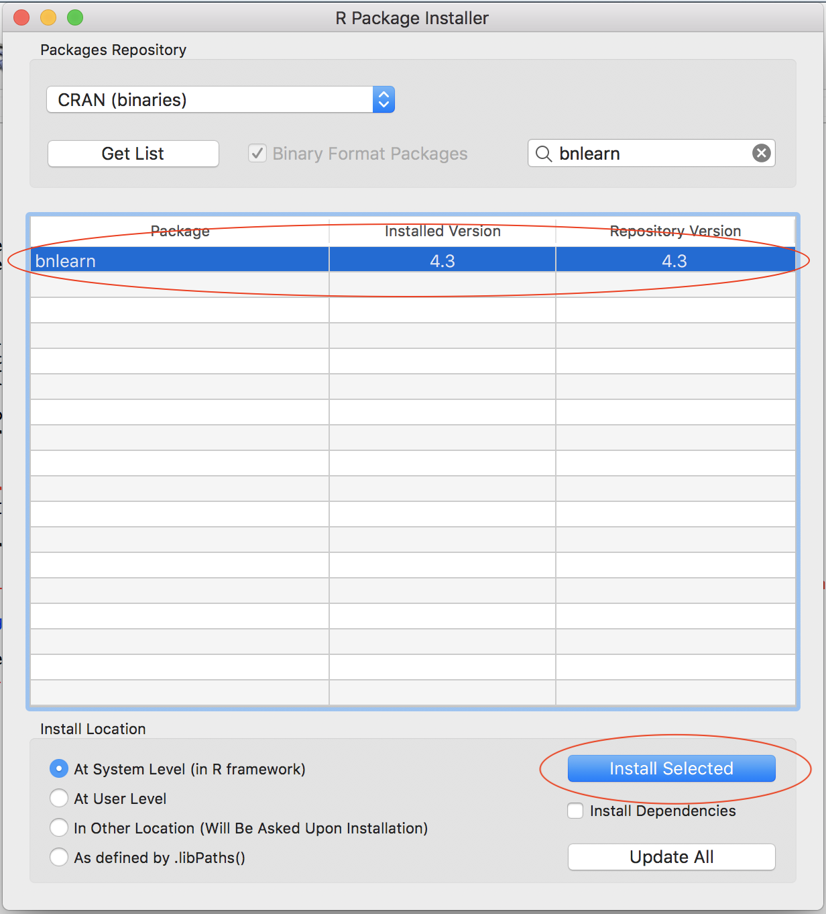

<!-- # Plan of work -->

<!-- important reference  -->
<!-- https://arxiv.org/pdf/0908.3817.pdf -->

<!-- Bayesian Networks -->

<!-- - data set asia -->
<!-- - Définir le BN a priori (avis d'expert, manuel) -->
<!-- Entrer la structure dans R et plot le -->
<!-- - Définir un petit BN vide -->
<!--     - Apprentissage de la structure par logiciel -->
<!--     - Differentes méthodes (algo) -->
<!-- - Comparer les BNs -->
<!--     - Calculer les vraisemblance de la structure -->
<!--     - On va fixer la structure (la meilleure) -->
<!--     - Apprentissage de paramètre -->
<!--     - Prédiction -->

<!-- ----------------------------------------------------------------------------------------------------------------------------------- -->

<!-- ----------------------------------------------------------------------------------------------------------------------------------- -->


# `bnlearn` package

The `bnlearn` package is one of the most complete and popular package for Bayesian Networks available to the date in `R`.

First we should install and load the package.

**Please make sure that you either download or compile at least `bnelarn 4.2.x` as previous versions might have some bugs.**

You should check out the documentation that is available online [[Link]](http://bnlearn.com/). It contains nice examples and additional use cases beyond this tutorial, if you are interested in this topic there are a couple of related books written by the author of the package, you can find the references in the mentioned website.

## Install R package `bnlearn`

```{r setup, include=FALSE}
knitr::opts_knit$set(root.dir = '..')
if(!require(magrittr)) {install.packages("magrittr"); library(magrittr);}
# rm(list = ls())
# knitr::opts_chunk$set(fig.align = 'center', fig.show='hold', out.width = '70%',
                      # warning=FALSE, message=FALSE)

knitr::opts_chunk$set(
  comment = "#>",
  # collapse = TRUE,
  cache = TRUE,
  out.width = "70%",
  fig.align = 'center',
  fig.width = 6,
  fig.asp = 0.618,  # 1 / phi
  fig.show = "hold",
  warning=FALSE, message=FALSE
)
```

### Method 1 : Graphic User Interface { - }

- Open R
    - { width=10% }
- Open Package Installer
    - Menu / Packages & Data / Package Installer
    - { width=70% }
- install package `bnlearn`

    - { width=49% } { width=49% }
    - Click on "Get List"
        - Choose a CRAN mirror (you are free to choose any cran mirror)
    - search `bnlearn`
        <!-- - { width=50% } -->
    - select `bnlearn` 
        - the selected line turns to blue
        - the "install Selected" buttom turns to blue
    - click on "install Selected" buttom
- close the "Package Installer" window
    - load the package `bnlearn`
    - copy and past following code (click on the `code` button to show the hidden code) to console prompt: after `>`, then press "enter".
        - If you see `Update all/some/none? [a/s/n]: `, reply `n` then press `enter`
        - If you see `[1] "Congratulations, the package bnlearn is correctly installed."`, the package `bnlearn` is correctly installed.
        - If not, please contact us !!

```{r echo = T, message=FALSE, warning=FALSE}
if(require(bnlearn, quietly = TRUE) && require(Rgraphviz, quietly = TRUE)){
    print("Congratulations, the package bnlearn is correctly installed.")
}else{
  source('http://bioconductor.org/biocLite.R')
  biocLite('Rgraphviz')
  biocLite("RBGL")
  if(!require(bnlearn)) install.packages("bnlearn")
  if(require(bnlearn) && require(Rgraphviz)){
    print("Congratulations, the package bnlearn is correctly installed.")
  }else print("Contact us !!!")
}
```

### Method 2 : console prompt `>` { - }

- copy and past following code (click on the `code` button to show the code) to console prompt: after `>`, then press "enter"
    - if you see [1] `"Congratulations, the package bnlearn is correctly installed."` then the package `bnlearn` is correctly installed.
    - if not, please contact us !!

```{r eval=FALSE}
if(require(bnlearn, quietly = TRUE) && require(Rgraphviz, quietly = TRUE)){
    print("Congratulations, the package bnlearn is correctly installed.")
}else{
  source('http://bioconductor.org/biocLite.R')
  biocLite('Rgraphviz')
  biocLite("RBGL")
  if(!require(bnlearn)) install.packages("bnlearn")
  if(require(bnlearn) && require(Rgraphviz)){
    print("Congratulations, the package bnlearn is correctly installed.")
  }else print("Contact us !!!")
}
```

-----------------------------------------------------------------------------------------------------------------------------------

-----------------------------------------------------------------------------------------------------------------------------------

# Data

The hands-on workshop is based on the data set `asia`, a small synthetic data set from Lauritzen and Spiegelhalter (1988) about lung diseases (tuberculosis, lung cancer or bronchitis) and visits to Asia.

**Source**

Lauritzen S, Spiegelhalter D (1988). "Local Computation with Probabilities on Graphical Structures and their Application to Expert Systems (with discussion)". Journal of the Royal Statistical Society: Series B (Statistical Methodology), 50(2), 157-224.

**Load**

- Load the data set from the `bnlearn` package
    - show the R commands then type them in R console prompt: after `>`, then press "enter" (we strongly advise you to type the code than to copy paste them)

```{r include=TRUE}
# list objects in the working environment
ls()
# Import the data set called asia
data(asia)
# list the variables (column names) in asia
# NOT RUN : colnames(asia)
# Delete the column called "E"
asia$E = NULL
# Verify if the data set "asia" appears in the working environment ?
ls()
```

**Format**

- Each variable is in a column.
- Each observation is a row.
- Each value is a cell.

The asia data set contains the following variables:

- `D` (dyspnoea),       
    - a two-level factor with levels `yes` and `no`.
- `T` (tuberculosis),   
    - a two-level factor with levels `yes` and `no`.
- `L` (lung cancer),    
    - a two-level factor with levels `yes` and `no`.
- `B` (bronchitis),     
    - a two-level factor with levels `yes` and `no`.
- `A` (visit to Asia),  
    - a two-level factor with levels `yes` and `no`.
- `S` (smoking),        
    - a two-level factor with levels `yes` and `no`.
- `X` (chest X-ray),    
    - a two-level factor with levels `yes` and `no`.
<!-- - `E` (tuberculosis versus lung cancer/bronchitis),  -->
<!--     - a two-level factor with levels `yes` and `no`. -->

**Usage**

- Investigate the characteristics of `asia` using some basic `R` operations :
<!-- (These are basic `R` operations that are not crucial for us, unroll the `Code` box) and execute them in R. -->
    - Print the data set on screen;
    - Verify the format of data : variable names and values (levels) ;
    - What is the sample size := how many individuals are there?
    - Summarise the data set with a build-in function `summary()`.

```{r, eval = TRUE}
# print data set 
# NOT RUN: asia
# You may want to run asia. What it gives?

# The first five lines should be enough to get a very first idea of the data set asia
# Verify the format of data : variable names and types.
head(asia, n = 5)

# What is the sample size := how many individuals are there?
nrow(asia)

# summarise the data set with a build-in function summary()
summary(asia)
```

----

----

# Exercises : Structure Learning
## Expert-Driven Approach

There are different ways to manually initialise and modify the graph of a Bayesian Network. We illustrate in this hands-on session one of the options.

- to create a *formula* for a given set of variables. Each node is specified by a pair of brackets `[<var_name>]`. If the node has a parent set, we denote it by `|` and specify the list of parents separated by colons `:`. We can compute the *formula* into a `bn` object with `model2network`. (see Example below)

### Example { - }

- R syntax for manually defining a BN structure using `model2network()` function

```{r example_dag, fig.align="center", out.width='70%'}
# manually define a BN structure using model2network() function
dag_example = model2network("[Earthquake][Alert|Earthquake][Anxiety|Alert:Earthquake]")
# Plot the BN structure with graphviz.plot()
graphviz.plot(dag_example, sub = "Example DAG")
```

**Remark** 

```{r eval = F}
# the order doesn't matter : the three definitions below are equivalent
model2network("[Earthquake][Alert|Earthquake][Anxiety|Alert:Earthquake]")
model2network("[Earthquake][Alert|Earthquake][Anxiety|Earthquake:Alert]")
model2network("[Earthquake][Anxiety|Alert:Earthquake][Alert|Earthquake]")
```

----

### Exercise 3.1 { - }

Now, it's your turn : 

**Suppose** we use the following variable names:

- `A` : Visit to Asia
- `B` : Bronchitis
- `D` : Dyspnea
- `L` : Lung Cancer
- `T` : Tuberculosis
- `S` : Smoking History
- `X` : Chest X-ray

#### Questions { - }

**Define a BN structure (a DAG) representing the causal relationships among these variables based on your knowledge :**

- What are the causal relationships among the variables in `asia` data set ?
- Use a BN structure (a DAG) to represent your causal relationships.
- Encode in `R` your BN structure with `model2network()` and assign the output of `model2network()`, your BN structure, to `dag_mydag` (see the example above)
<!-- - What is the class of the output of function `model2network()`? -->
- Plot your BN structure with `graphviz.plot()`.

#### Solution { - }

<button class="btn btn-primary" data-toggle="collapse" data-target="#Exercise_1"> Show/Hide </button>  
<div id="Exercise_1" class="collapse">  
<div class="boxed">

Following code shows one possible solution. Other BN structures are also acceptable.

```{r eval=TRUE, fig.align = 'center', fig.show='hold', out.width = '70%'}
# Create and plot the network structure.
dag_mydag = model2network("[A][S][T|S][L][B|S][D|B][X|L:T]")
# Plot
graphviz.plot(dag_mydag)
```

</div>
</div>

----

<!-- ```{r} -->
<!-- summary(asia) -->
<!-- dim(asia) -->
<!-- spec = "[A][S][T|A][L|S][B|S][D|B:E][E|T:L][X|E]" -->
<!-- bn = model2network(spec) -->

<!-- bn.skel = skeleton(bn)  -->
<!-- graphviz.plot(bn.skel)  -->
<!-- bn.moral = moral(bn) -->
<!-- graphviz.plot(bn.moral)  -->
<!-- bn.eq = cpdag(bn) -->
<!-- graphviz.plot(bn.eq) -->
<!-- vs = vstructs(bn.eq, arcs = TRUE)  -->
<!-- graphviz.plot(bn.eq, highlight = -->
<!--                 list(arcs = vs, lwd = 2, col = "grey")) -->
<!-- graphviz.plot(bn.eq, highlight = list(nodes = nodes(bn), fill = c("blue"), col = "black")) -->


<!-- par(mfrow = c(2, 5)) -->
<!-- layout = c("dot", "neato", "twopi", "circo", "fdp") -->
<!-- for (l in layout) { -->
<!--   shape = c("ellipse", "circle") -->
<!--   for (s in shape) { -->
<!--     main = paste(l, s) -->
<!--     graphviz.plot(bn.eq, shape = s, layout = l, -->
<!--     main = main) -->
<!--     } -->
<!-- } -->
<!-- ``` -->


```{r eval = F, include=F}
plotD3bn <- function(bn) {
  varNames <- nodes(bn)

  # Nodes should be zero indexed!
  links <- data.frame(arcs(bn)) %>%
    mutate(from = match(from, varNames)-1, to = match(to, varNames)-1, value = 1)
  
  nodes <- data.frame(name = varNames) %>%
    mutate(group = 1, size = 30)
  
  networkD3::forceNetwork(
    Links = links,  
    Nodes = nodes,
    Source = "from",
    Target = "to",
    Value = "value",
    NodeID = "name",
    Group = "group",
    fontSize = 20,
    zoom = TRUE,
    arrows = TRUE,
    bounded = TRUE,
    opacityNoHover = 1
  )
}
if(!require(networkD3)) install.packages("networkD3")
plotD3bn(dag_mydag)
library(tidyverse)
load(url("http://www.bnlearn.com/bnrepository/asia/asia.rda"))
bn.net(bn)
bn.fit.barchart(bn$dysp)
```


----

### Exercise 3.2 { - }

**Source** This exercise is from this [[LINK]](http://www.cs.technion.ac.il/~dang/books/Learning%20Bayesian%20Networks(Neapolitan,%20Richard).pdf)

<!-- **Note** -->

<!-- Lauritzen and Spiegelhalter (1988) motivate this example as follows: -->

<!-- “Shortness-of-breath (dyspnoea) may be due to tuberculosis, lung cancer or bronchitis, or none of them, or more than one of them. A recent visit to Asia increases the chances of tuberculosis, while smoking is known to be a risk factor for both lung cancer and bronchitis. The results of a single chest X-ray do not discriminate between lung cancer and tuberculosis, as neither does the presence or absence of dyspnoea.” -->

<!-- <!-- Standard learning algorithms are not able to recover the true structure of the network because of the presence of a node (E) with conditional probabilities equal to both 0 and 1. Monte Carlo tests seems to behave better than their parametric counterparts. --> 

<!-- **End of Note** -->

Consider the following piece of medical knowledge taken from [Lauritzen and Spiegelhalter, 1988]: 

- Tuberculosis and lung cancer can each cause shortness of breath (dyspnea) and a positive chest X-ray. 
- Bronchitis is another cause of dyspnea. 
- A recent visit to Asia can increase the probability of tuberculosis. 
- Smoking can cause both lung cancer and bronchitis. 

#### Questions { - }

**Create again a DAG representing the causal relationships among these variables based on upper medical knowledge**

- Encode the BN structure with `model2network()`.
- Plot this BN structure with `graphviz.plot()`.
- Plot again your BN structure and compare.

#### Solution { - }

<!-- # dag_Laur = model2network("[A][S][T|A][L|S][B|S][D|B:E][E|T:L][X|E]") -->

<button class="btn btn-primary" data-toggle="collapse" data-target="#Exercise_2"> Show/Hide </button>  
<div id="Exercise_2" class="collapse">  
<div class="boxed">
```{r}
# creat Lauritzen's BN structure
dag_Laur = model2network("[A][S][T|A][L|S][B|S][D|B:T:L][X|T:L]")
dag_Laur
```

**Remark** the generation algorithm is Empty !!

```{r}
par(mfrow = c(1,2))
graphviz.plot(dag_Laur, sub = "Lauritzen's DAG")
graphviz.plot(dag_mydag, sub = "My DAG")
```

</div>
</div>

----

----

## Data-driven approach

### Exercise 3.3 : Score-based methods { - }

#### Questions { - }

- Learn a BN structure base on `asia` data set. `hc(asia)` can allow you to do this (this time, Hill-Climbing algorithm, which is a Score-based method, is applied)
- Plot the BN structure (output of `hc(asia)`)
- What do you observe ? Is this a DAG ?

#### Solution { - }

<button class="btn btn-primary" data-toggle="collapse" data-target="#Exercise_5"> Show/Hide </button>  
<div id="Exercise_5" class="collapse">  
<div class="boxed">

```{r}
dag_learn_hc = hc(asia)
dag_learn_hc
graphviz.plot(dag_learn_hc)
```

</div>
</div>

----

----

<!-- ## Mix approach -->

<!-- <span style="color:red"> *Wang's note : la sub-section Mix approach peut être éliminée si elle surcharge le contenu*</span> -->

<!-- The first step in learning a Bayesian network is structure learning, that is, using the data to determine which arcs are present in the graph that underlies the model. Normally, we would like for that to be a purely data-driven process — for the purposes of exploring the data, in benchmarking learning algorithms, or just because we do not know much about the phenomenon we are trying to model. However, in some contexts we have prior knowledge on what the structure of the network should look like and we would like to incorporate such knowledge in the structure learning process. One way to do that is to use whitelists and blacklists. Both are implemented as follows in bnlearn. -->

<!-- 1. Arcs in the whitelist are always included in the network. -->
<!-- 1. Arcs in the blacklist are never included in the network. -->
<!-- 1. Any arc whitelisted and blacklisted at the same time is assumed to be whitelisted, and is thus removed from the blacklist. In other words, the whitelist has precedence over the blacklist. -->

<!-- These general rules are applied in slightly differently to different classes of structure learning algorithms, because the latter search for the optimal model in different spaces and in different ways. For instance, score-based learning algorithms operate on the space of DAGs, and therefore cannot deal with whitelisted undirected arcs. -->

<!-- ---- -->

## Comparing Bayesian network structures

### Qualitative methods { - }

#### - `compare()` function { - }

`compare()` function compares two Bayesian network structures by listing three elements (output of `compare()`) that are the counts of:

- the true positive  (`tp`) arcs, which appear both in `target` and in `current`;
- the false positive (`fp`) arcs, which appear in `current` but not in `target`;
- the false negative (`fn`) arcs, which appear in `target` but not in `current`.

```{r}
compare(target = dag_Laur, current = dag_mydag, arcs = TRUE)
```

#### - `graphviz.compare()` function { - }

Another approach to compare network structures is to plot them side by side and highlight differences with different colours. `graphviz.compare()` does that using `Rgraphviz` package while taking care that the nodes have the same position for all networks, to make it easier to spot which arcs are different. As we can see below, and unlike any of the functions we covered above, `graphviz.compare()` can take more than two network structures as arguments.

```{r fig.align="center", out.width= '100%'}
par(mfrow = c(1, 3))
graphviz.plot(dag_Laur, sub = "dag_Laur")
graphviz.plot(dag_mydag, sub = "dag_mydag")
graphviz.plot(dag_learn_hc, sub = "dag_learn_hc")
```

```{r fig.align="center", out.width= '100%'}
par(mfrow = c(1, 3))
graphviz.compare(dag_Laur, dag_mydag, dag_learn_hc)
```

```{r eval = FALSE, include=FALSE}
par(mfrow = c(1,2)) # show two plots side by side
graphviz.compare(dag_Laur, dag_mydag)
```

### Quantitative method { - }

#### - `score()` function { - }

We can compute the network score of a particular graph for a particular data set with the `score()` function (manual).
<!-- if the score function is not specified, the BIC score is returned for both continuous and discrete data. -->

**Remark** In case the `score()` function is defined differently in several packages, you should specify from which package we what to call the function. That is, there is any error we you use `score()` function, replace `score()` by `bnlearn::score()` so that r knows you want to use score function from the `bnlearn` package.

**Remarks:**

- The number of variables in the network and in the data must be the same, although the order is not important.
- The names of the variables must match as well.

```{r eval = F, include=TRUE}
score(dag_mydag, asia) 
score(dag_Laur , asia)
score(dag_learn_hc, asia)

# if it does not work, try bnlearn::score()

# bnlearn::score(dag_mydag, asia) 
# bnlearn::score(dag_Laur , asia)
# bnlearn::score(dag_learn_hc, asia)
```

**Remark: ** The scores of `dag_Laur` and `dag_learn_hc` are almost the same.

----

# Exercises: Parameter Learning

In general, there are three ways of creating a `bn.fit` object representing a Bayesian network:

1. a data-driven approach, learning it from a data set using bn.fit() and a network structure (in a bn object) as illustrated here;
1. an expert-driven approach, in which both the network structure and the parameters are specified by the user;
1. a hybrid approach combining the above.

We will talk about the first and the third.

## Data-driven approach

Once the structure of a DAG has been determined, the parameters can be determined as well. Two most common approaches are 

- **maximum likelihood estimation (MLE)** and 
- **Bayesian estimation**. 

Parameter estimates are based only on the subset of data spanning the considered variable and its parents. 
<!-- The `bn.fit` function from `bnlearn` will automatically determine the type of data and fit parameters. -->
When using `bnlearn`, parameter learning is performed by the `bn.fit` function, which takes the network structure and the data as *arguments*.

----

### Exercise 4.1 (Demonstration) { - }

#### Questions { - }
- Use `asia` data set to learn three sets of parameters based on: (`bn.fit(x = one_of_BN_Structures_of_your_choice, data = asia, method = "mle")`)
    - your BN structure 
    - Lauritzen's BN structure
    - the data-driven BN structure (output of Hill-Climbing algorithm)
- Print the output of `bn.fit()` function and find out the conditional probability table (CPT) of Lung Cancer with respect to (given) Smoking History : $\Pr(L\,|\,S) =  ?$
- Calculate how much smoking causes lung cancer :

$$\frac{\Pr(L = yes \,|\,S = \text{yes})}{\Pr(L = yes \,|\,S = \text{no})} = ?$$

**Remark** As you are not given any example showing how to use `bn.fit`, type simply `?bn.fit` and try to figure it out by yourself. Otherwise, you are free to check the solution below.

#### Solution { - }

<button class="btn btn-primary" data-toggle="collapse" data-target="#DontSmoke"> Show/Hide </button>  
<div id="DontSmoke" class="collapse">  
<div class="boxed">

- learn three sets of parameters

```{r}
# By default bn.fit use mle mthod :  
# bn.fit(x, data) == bn.fit(x, data, method = "mle")
bn_mydag          = bn.fit(x = dag_mydag,     data = asia, method = "mle")
bn_dag_Laur       = bn.fit(x = dag_Laur,      data = asia, method = "mle")
bn_dag_learn_hc   = bn.fit(x = dag_learn_hc,  data = asia, method = "mle")

# Optional
# bn_mydag_bayes          = bn.fit(x = dag_mydag,     data = asia, method = "bayes")
# bn_dag_Laur_bayes       = bn.fit(x = dag_Laur,      data = asia, method = "bayes")
# bn_dag_learn_hc_bayes   = bn.fit(x = dag_learn_hc,  data = asia, method = "bayes")
```

- Print the output of `bn.fit()` function and find out the conditional probability table (CPT) of Lung Cancer with respect to (given) Smoking History : $\Pr(L\,|\,S) =  ?$

```{r results="show", fig.show="show"}
# You can print CPTs attached to all nodes in a given BN structure (for example bn_dag_Laur) using : `bn_dag_Laur`
# But the list of CPTs might be too long

# print just the CPT of Lung Cancer with respect to Smoking History
coef(bn_dag_Laur$L) # or simply run : bn_dag_Laur$L
# you can also represent a CPT with barchart.
bn.fit.barchart(bn_dag_Laur$L)
```

- Calculate how much smoking causes lung cancer :

$$\frac{\Pr(L = yes \,|\,S = \text{yes})}{\Pr(L = yes \,|\,S = \text{no})} =\frac{0.11769384}{0.01368209} = 8.6020348$$ 

<p align="center">
  
</p>

</div>
</div>

----

## Hybrid approach

Specifying all the local distributions can be problematic in a large network. In most cases it can be more convenient to create a `bn.fit` object from (possibly dummy) data using `bn.fit()`, and then to modify just the local distributions of the nodes of interest.

### Demonstration 4.2 { - }

- Creating custom fitted Bayesian networks using both data and expert knowledge.
    - For discrete Bayesian networks we can extract the conditional probability table stored in the `bn.fit` object with `coef()`, modify it, and re-save it.

#### `R` Code { - }

<button class="btn btn-primary" data-toggle="collapse" data-target="#HybridApproach"> Show/Hide </button>  
<div id="HybridApproach" class="collapse">  
<div class="boxed">

```{r results = "show"}
dag = dag_Laur
fitted = bn.fit(dag, asia)
cpt = coef(fitted$S)
# Imagine the distribution of Smoking history in a population is "no": 70% , and "yes" : 30%
cpt[1:2] = c(0.7, 0.3) # The probability distribution of node S must sum to one.
fitted$S = cpt
fitted
```

</div>
</div>

----

# Exercises: Prediction

**Inference and probability queries**

The inference engine of `bnlearn` is limited, but it can be used to test the networks and to perform basic operations with the models.

By using `cpquery()` we can ask for the probability of an `event` given a set of `evidence`. We may ask for a particular combination of configurations in the BN and a set of observed statuses for the variables in the evidence. For example, we could ask, what is the posibility of a positive cancer diagnosis for a person that smokes?, in the `asia` network.

Reference : http://jarias.es/bayesnetRtutorial/#inference_and_probability_queries

## Conditional probability query

- Interested in the marginal posterior probability distribution of variables given evidence on other variables
- Most likely outcome (a.k.a. maximum a posteriori)
- Interested in finding the configuration of the variables that have the highest posterior probability (discrete)

- `cpquery()` estimates the conditional probability of event given evidence.
- `cpdist()` generates random observations conditional on the evidence.

**Remark** 

Note that both `cpquery()` and `cpdist()` are based on Monte Carlo particle filters, and therefore they may return slightly different values on different runs.

```{r, eval = FALSE, include = FALSE}
bn_dag_Laur$B$prob[2,2]

set.seed(20180308)
run1 <- replicate(100, 
          cpquery(fitted = bn_dag_Laur, 
                  event = (L == "yes"), 
                  evidence = TRUE)
          )

run2 <- replicate(100, 
          cpquery(fitted = bn_dag_Laur, 
                  event = (L == "yes"), 
                  evidence =(S == "yes"),
                  n = 1000000)
          )

# par(mfrow = c(1,2))
# hist(run1, xlim = range(run1))
# hist(run2, xlim = range(run1))
# par(mfrow = c(1,1))
```

```{r eval = F, include=F, echo = F}
library(bnlearn)
?cpquery
```


### Example { - }

#### - `cpquery()` { - }

- Prior probability of `Dyspnea` being `yes`

```{r}
# cpquery(fitted, event, evidence, cluster = NULL, method = "ls", ..., debug = FALSE)
set.seed(20180308)
# Prior distribution of Lung cancer
cpquery(fitted = bn_dag_Laur, 
        event = (D == "yes"), 
        evidence = TRUE, # evidence being true means that we have no prior evidence.
        n = 100000)
```

- Posterior probability of `Dyspnea = yes` given Lung cancer being `no`

```{r}
# Posterior distribution of Lung cancer given Smoking history being "no"
cpquery(fitted = bn_dag_Laur, 
        event = (D == "yes"), 
        evidence = (L == "no"),
        n = 100000)

```

-  Posterior probability of `Dyspnea = yes` given Lung cancer being `yes`

```{r}
# Posterior distribution of Lung cancer given Smoking history being "yes"
cpquery(fitted = bn_dag_Laur, 
        event = (D == "yes"), 
        evidence = (L == "yes"),
        n = 100000)
```


#### - `cpdist()` { - }

```{r}
# cpdist( fitted, nodes, evidence, cluster = NULL, method = "ls", ..., debug = FALSE)
set.seed(20180308)

prop.table(
  table(
    cpdist(fitted = bn_dag_Laur, 
           nodes = c("D"),
           evidence = TRUE,
           n = 100000))
)

prop.table(
  table(
    cpdist(fitted = bn_dag_Laur, 
           nodes = c("D"),
           evidence = (L == "no"),
           n = 100000))
)

prop.table(
  table(
    cpdist(fitted = bn_dag_Laur, 
           nodes = c("D"),
           evidence = (L == "yes"),
           n = 100000))
)
```

### Exercise 5.1 { - }

- Calculate by hand 
    - $\Pr (L = yes\,|\,S = yes)$ : Probability of an individual having lung cancer 
    - $\Pr (L = yes\,|\,S = no)$ : Probability of an individual having lung cancer given that he/she has **NO** smoking history.
    - $\Pr (L = yes)$
- Estimate following probabilties using `cpquery()` 
    - $\hat{\Pr} (L = yes)$ : Probability of an individual having lung cancer 
    - $\hat{\Pr} (L = yes\,|\,S = yes)$ : Probability of an individual having lung cancer given that he/she has smoking history 
    - $\hat{\Pr} (L = yes\,|\,S = no)$ : Probability of an individual having lung cancer given that he/she has **NO** smoking history.
- Calculate the ratio between $\hat{\Pr}(L = yes\,|\,S = yes)$ and $\hat{\Pr}(L = yes\,|\,S = no)$
- Compare the ratio with "Exercise 4.1 under Section 4.1 Data-driven approach"

#### Solution { - }

<button class="btn btn-primary" data-toggle="collapse" data-target="#Prediction"> Show/Hide </button>  
<div id="Prediction" class="collapse">  
<div class="boxed">

- Calculate by hand 
    - $\Pr (L = yes\,|\,S = yes) = 0.11769384$ (read from `coef(bn_dag_Laur$L)`)
    - $\Pr (L = yes\,|\,S = no) = 0.01368209$ (read from `coef(bn_dag_Laur$L)`)
    -  $\Pr (L = yes) = 0.11769384 \times 0.503 + 0.01368209 \times 0.497 = 0.066$

**Recall**

$$\Pr(L = yes) = {\huge[} \Pr(L = yes\,|\,S = yes) \times \Pr(S = yes){\huge+}\Pr(L = yes\,|\,S = no)\times\Pr(S = no){\huge]} $$

```{r eval = F}
coef(bn_dag_Laur$L)
coef(bn_dag_Laur$S)
0.11769384 * 0.503 + 0.01368209 * 0.497 # sum(coef(bn_dag_Laur$L) [2,] * coef(bn_dag_Laur$S))
```


- Estimate following probabilties using `cpquery()`

```{r}
set.seed(20180308)

L_prior = cpquery(fitted = bn_dag_Laur, 
            event = (L == "yes"), 
            evidence = TRUE, # evidence being true means that we have no prior evidence.
            n = 100000)
L_prior

L_S_yes = cpquery(fitted = bn_dag_Laur, 
            event = (L == "yes"), 
            evidence = (S == "yes"),
            n = 100000)
L_S_yes

L_S_no  = cpquery(fitted = bn_dag_Laur, 
            event = (L == "yes"), 
            evidence = (S == "no"),
            n = 100000)
L_S_no

L_ratio = L_S_yes / L_S_no
L_ratio
```
</div>
</div>

### Exercise 5.2 { - }

- Estimate following probabilties using `cpquery()` 
    - $\hat{\Pr} (S)$ : Probability of an individual having smoking history 
    - $\hat{\Pr} (S = yes\,|\,L = yes)$ : Probability of an individual having smoking history given that he/she has lung cancer  
    - $\hat{\Pr} (S = yes\,|\,L = no)$ : Probability of an individual having smoking history given that he/she does **NOT** have lung cancer.
- Calculate the ratio between $\hat{\Pr}(S = yes \,|\,L = yes)$ and $\hat{\Pr}(S = yes\,|\,L = no)$
- Calculate (by hand) the ratio between $\Pr(S = yes \,|\,L = yes)$ and $\Pr(S = yes \,|\,L = no)$ (homework!!)

<!-- **Recall** Bayes Rule: -->
<!-- $$\Pr(B|A) = \frac{\Pr(A|B) \times \Pr(B)}{\Pr(A)}$$ -->

<!-- $$\Pr(L = yes) = {\huge[} \Pr(L = yes\,|\,S = yes) \times \Pr(S = yes){\huge+}\Pr(L = yes\,|\,S = no)\times\Pr(S = no){\huge]} $$ -->

<!-- $$\Pr(S = yes\,|\,L = yes) = \frac{\Pr(L = yes \,|\, S = yes) \times \Pr(S = yes)}{\Pr(L = yes)}$$ -->


# Notes

Source: https://www.norsys.com/tutorials/netica/secA/tut_A1.htm

### Probabilities need not be exact to be useful { - }

Some people have shied away from using Bayes nets because they imagine they will only work well, if the probabilities upon which they are based are exact. This is not true. It turns out very often that approximate probabilities, even subjective ones that are guessed at, give very good results. Bayes nets are generally quite robust to imperfect knowledge. Often the combination of several strands of imperfect knowledge can allow us to make surprisingly strong conclusions.

### Causal Conditional Probabilities are easier to estimate than the reverse { - }

Studies have shown people are better at estimating probabilities "in the forward direction". For example, doctors are quite good at giving the probability estimates for "if the patient has lung cancer, what are the chances their X-ray will be abnormal?", rather than the reverse, "if the X-ray is abnormal, what are the chances of lung cancer being the cause?" (Jensen, Finn V. (1996) An Introduction to Bayesian Networks, Springer Verlag, New York.)

----

----

[Back to home](https://goo.gl/j9PYg4)